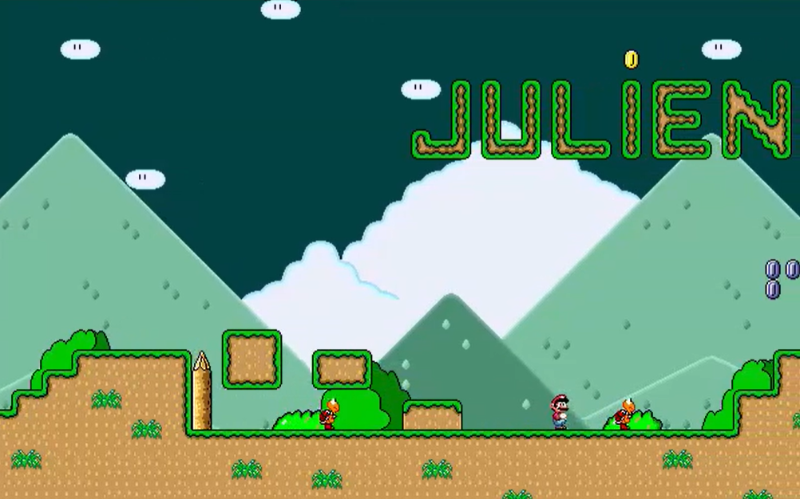
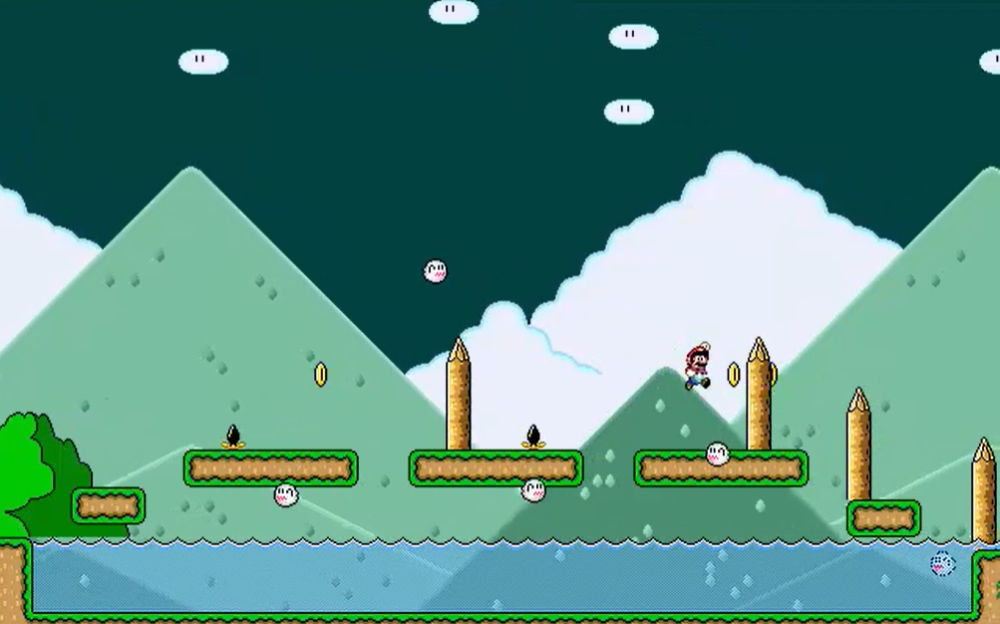
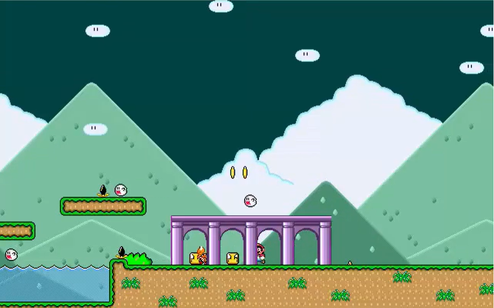

# MarioPy
A simple platform game example using PyGame

Clic on the screenshots to see the video

- Arrow left / right to move Mario
- Space bar to jump
- ESC to quit game

To build this game on a windows platform, launch build.cmd
The game exe will be located in /dist

To launch this game in Python, you must first install the required librairies:
- pygame
- pytmx

The game main file is main.py

